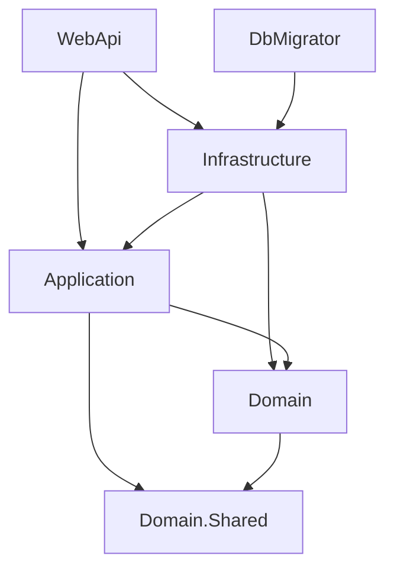

# Template Web Backend

**简体中文** | [English](docs/README.en.md)

基于 **.NET 10 / ASP.NET Core** 的后端项目模板，通过 `dotnet new` 生成带有自定义项目名和命名空间的解决方案。适合从分层结构、数据库迁移、认证授权和测试基础上开始构建业务 API。

模板以用户、角色、菜单和权限作为示例，包含 PostgreSQL 持久化、Redis 会话、JWT、验证码、DTO 映射以及独立数据库迁移程序。角色权限快照的初始化和同步仍需补齐；接入业务前请阅读[当前实现边界](#当前实现边界)。

## 导航

- [环境要求](#环境要求)
- [使用模板创建项目](#使用模板创建项目)
- [本地开发与首次启动](#本地开发与首次启动)
- [项目结构与架构](#项目结构与架构)
- [配置说明](#配置说明)
- [数据库迁移](#数据库迁移)
- [部署文件与容器部署](#部署文件与容器部署)
- [测试与开发约定](#测试与开发约定)
- [当前实现边界](#当前实现边界)
- [常见问题](#常见问题)

## 环境要求

| 工具或服务 | 用途 |
| --- | --- |
| .NET 10 SDK | 模板安装、项目生成、编译、测试和本地运行 |
| PostgreSQL | 用户、角色、权限及 EF Core 迁移历史 |
| Redis | 当前登录会话、验证码答案和角色权限快照 |
| Git | 获取模板源码及管理生成项目的版本 |
| Docker 与 Docker Compose（可选） | 启动本地依赖或使用部署示例 |

下文命令使用 **PowerShell**，从相应项目根目录执行。macOS/Linux 用户需调整环境变量赋值、路径和 HTTPS 证书信任方式。编译和现有自动化测试不要求启动 PostgreSQL/Redis；完整 API 业务运行需要这些依赖。

## 使用模板创建项目

### 1. 安装本地模板

获取本仓库并进入根目录，然后执行：

```powershell
$templatePath = (Get-Location).Path
dotnet new install $templatePath
dotnet new list org-product-web
```

模板短名称是 `org-product-web`，配置位于模板源码的 `.template.config/template.json`。这是从源码目录安装的模板，不需要先发布 NuGet 包。

### 2. 生成命名后的解决方案

以下命令从模板仓库根目录执行，将项目生成到同级的新目录：

```powershell
dotnet new org-product-web --name Acme.Demo --output ../Acme.Demo
Set-Location ../Acme.Demo
```

`--name` 会替换模板中的 `Org.Product`，包括解决方案名、项目名、命名空间和文件内容。生成结果包括 `Acme.Demo.sln`、`src/Acme.Demo.WebApi/` 等项目。`--output` 指定输出位置；更换目录不会自动替代明确指定的项目名称。

生成前可以预览文件变化：

```powershell
dotnet new org-product-web --name Acme.Demo --output ../Acme.Demo --dry-run
```

模板排除 `.git`、`.vs`、`bin`、`obj`、用户设置、`*Backup*` 和 `keys` 内容。生成结果也不包含模板元数据目录 `.template.config`；安装或更新模板的操作应在模板源码目录执行。生成项目后按需执行 `git init`，建立独立版本历史。

建议使用干净的模板源码目录生成项目：当前排除规则不覆盖所有部署运行数据，例如本地数据库卷目录。不要将已写入连接凭据、日志或服务数据的工作目录作为分发模板。

### 3. 更新或卸载模板

从模板源码目录更新代码后，重新安装该目录：

```powershell
dotnet new install . --force
```

卸载时指定最初安装的模板目录；`dotnet new uninstall` 不带参数可查看已安装来源：

```powershell
dotnet new uninstall
dotnet new uninstall <模板源码目录的绝对路径>
```

重新安装影响后续生成，不会同步修改已经创建的业务项目。生成器也不会自动更换 WebApi 项目的 `UserSecretsId`；使用 user secrets 前，应在生成的 `.csproj` 中为新项目设置独立值，避免多个项目共用秘密存储。

## 本地开发与首次启动

### 1. 选择项目并还原依赖

在生成项目的根目录设置名称。若直接运行模板仓库，将第一行改为 `Org.Product`：

```powershell
$projectName = 'Acme.Demo'
$apiProject = "src/$projectName.WebApi/$projectName.WebApi.csproj"
$migratorProject = "src/$projectName.DbMigrator/$projectName.DbMigrator.csproj"
$infrastructureProject = "src/$projectName.Infrastructure/$projectName.Infrastructure.csproj"

dotnet restore "$projectName.sln"
dotnet build "$projectName.sln" --no-restore
dotnet tool restore
```

后续命令沿用这些变量；开启新的 PowerShell 会话时需要重新设置。显式指定 `.csproj`，避免直接运行原始模板中的项目目录时选中遗留的备份项目文件。

### 2. 准备 PostgreSQL 和 Redis

可以使用现有开发实例。若本机没有这些服务，下面是独立的本地容器示例；先替换数据库密码，并确认端口及容器名未被占用：

```powershell
docker run -d --name acme-demo-postgres -p 127.0.0.1:5432:5432 -e POSTGRES_DB=acme_demo -e POSTGRES_USER=app -e 'POSTGRES_PASSWORD=<本地数据库密码>' -v acme-demo-postgres:/var/lib/postgresql/data postgres:17-alpine
docker run -d --name acme-demo-redis -p 127.0.0.1:6379:6379 redis:7-alpine
```

示例仅向本机开放端口。PostgreSQL 使用命名卷；Redis 示例未配置密码和持久化，重建后会丢失会话等数据。已有同名容器时使用 `docker start acme-demo-postgres acme-demo-redis`，无需再次创建。数据库容器初次初始化可能需要等待片刻。

### 3. 配置当前开发会话

环境变量同时供 WebApi 和 DbMigrator 读取：

```powershell
$env:ConnectionStrings__Postgres = 'Host=localhost;Port=5432;Database=acme_demo;Username=app;Password=<本地数据库密码>'
$env:ConnectionStrings__Redis = 'localhost:6379'
$env:Jwt__Issuer = $projectName
$env:Jwt__Audience = "$projectName.Client"
$env:Jwt__KeyFolder = Join-Path (Get-Location).Path 'keys'
```

使用已启用认证的 Redis 时，在连接串中加入对应的 `password=...`。不要依赖仓库中的示例数据库凭据。上面的环境变量只在当前进程及其子进程中生效，终端关闭后需要重新设置。

### 4. 应用迁移，再启动 API

```powershell
dotnet run --project $migratorProject
if ($LASTEXITCODE -ne 0) { throw '数据库迁移失败，请先修复后再启动 API。' }

dotnet dev-certs https --trust
dotnet run --project $apiProject --launch-profile https
```

Development 环境的 Swagger 地址是 [https://localhost:7247/swagger](https://localhost:7247/swagger)，HTTP 监听地址为 `http://localhost:5156`。端口来自 WebApi 的 `Properties/launchSettings.json`。API 启动时不创建或迁移数据库。

JWT 密钥首次使用时会生成到 `Jwt:KeyFolder`，目录需要写权限。保留整对密钥可让后续运行继续验证已有签名；不要将私钥提交到 Git。

**首次启动的完成范围：** 上述步骤建立数据库并启动 API。初始迁移包含内置用户、角色和根权限，但不建立用户与角色的分配，也不创建 Redis 权限快照，因此带权限策略的接口还需要业务初始化流程。Swagger 能打开不代表完整授权流程已经就绪。

## 项目结构与架构

以下为模板源码结构；生成项目会替换 `Org.Product` 名称并省略模板元数据目录。

```text
.
├── .template.config/                dotnet new 模板元数据
├── .config/dotnet-tools.json         EF Core 本地工具
├── Org.Product.sln                  解决方案
├── src/
│   ├── Org.Product.WebApi/          HTTP、认证授权、配置和依赖组合
│   ├── Org.Product.Application/     应用服务、DTO、映射和能力接口
│   ├── Org.Product.Domain/          实体、值对象、仓储及工作单元接口
│   ├── Org.Product.Domain.Shared/   共享类型、异常、枚举和序列化辅助
│   ├── Org.Product.Infrastructure/  EF Core、Redis、安全和协议适配器
│   ├── Org.Product.DbMigrator/      独立迁移程序
│   └── Org.Product.Tests/           自动化测试和测试替身
├── deployment/                     Docker Compose 和服务配置示例
├── docs/architecture.md             详细架构与实现边界
└── AGENTS.md                        贡献指南
```

核心依赖方向如下，图中省略了部分直接引用和测试项目：



Application 定义用例需要的能力，Infrastructure 实现这些接口，WebApi 负责选择实现并组合依赖。Application 当前保留 `IQueryable` 和 EF Core 异步查询能力；每个修改用例负责自己的数据库提交。WebApi 对 EF Core、Options、认证、控制器和 Swagger 等框架能力优先使用原生 `AddXxx` 注册；业务适配器由自动发现的 Autofac 模块按接口根注册。新增普通 Application 服务、映射 Profile、MediatR Handler 或无参 Module 不需要修改 `Program.cs`。

主要技术包括 EF Core/Npgsql、StackExchange.Redis、Autofac、AutoMapper、MediatR、Serilog、Swagger 和 SkiaSharp。JWT 同时校验签名与 Redis 当前会话，新登录会替换同一用户的旧会话。

完整的依赖关系、请求流程、领域模型、事务边界、DTO 规则和授权机制见 [架构文档](docs/architecture.md)。

## 配置说明

WebApi 使用 `appsettings.json`、环境配置文件、Development user secrets 和环境变量。环境变量用双下划线表示层级，例如 `ConnectionStrings__Postgres`。

| 配置项 | 作用 |
| --- | --- |
| `ConnectionStrings:Postgres` | PostgreSQL 连接串；API 与迁移程序应指向同一数据库 |
| `ConnectionStrings:Redis` | 会话、验证码和权限快照的 Redis 连接 |
| `Jwt:Issuer` / `Audience` / `ExpireMin` | JWT 发行者、受众和有效期 |
| `Jwt:KeyFolder` | ES256 公私钥目录 |
| `Captcha:RequireVerification` / `ExpireSeconds` | 验证码校验开关和有效期 |
| `Captcha:FontFamily`、尺寸和装饰选项 | SkiaSharp 验证码渲染 |
| `OpenApiInfo` | Swagger 元数据；启动时仍要求该节存在且有效 |
| `Serilog` | 控制台、文件日志及日志级别 |

Development 配置当前关闭验证码校验；基础配置开启。是否启用应按实际环境明确设置。即使关闭登录校验，调用验证码生成接口仍需要有效的 SkiaSharp 原生依赖和字体。

API 可以使用 user secrets 保存本地配置，但独立 DbMigrator 不会自动读取 WebApi 的 user secrets。迁移连接串应单独提供，推荐像首次启动示例一样通过当前会话环境变量传入。

## 数据库迁移

迁移文件位于 `src/Org.Product.Infrastructure/Repositories/Migrations/`。DbMigrator 负责数据库部署，WebApi 只注册和使用持久化服务。

在已设置前文项目变量的终端中执行：

```powershell
# 生成幂等 SQL，供部署前审阅；不连接数据库
dotnet run --project $migratorProject -- --script migration.sql

# 修改模型后添加版本化迁移
dotnet tool restore
dotnet ef migrations add DescribeChange --project $infrastructureProject --startup-project $migratorProject --output-dir Repositories/Migrations

# 对明确配置的数据库应用待执行迁移
dotnet run --project $migratorProject
```

迁移程序退出码为：成功 `0`、执行失败 `1`、参数错误 `2`。重新执行只应用待执行迁移，不会重复插入初始种子数据。部署顺序为数据库准备 → 迁移成功 → 启动或升级 API。

设计时工厂仅使用占位连接串构建模型，不加载 WebApi 配置或秘密，也不决定实际部署目标。执行迁移时必须明确提供目标连接串。迁移账号可以具有结构变更权限，API 账号仅保留业务运行权限，两者应连接同一数据库。

### 独立迁移容器

需要在部署流水线中单独运行迁移时，可从项目根目录构建并执行：

```powershell
docker build -f "src/$projectName.DbMigrator/Dockerfile" -t acme-demo-dbmigrator:local .
$env:ConnectionStrings__Postgres = 'Host=<容器可访问的数据库地址>;Port=5432;Database=acme_demo;Username=<迁移用户>;Password=<数据库密码>'
docker run --rm -e ConnectionStrings__Postgres acme-demo-dbmigrator:local
```

容器中的 `localhost` 指向容器自身。若数据库属于本项目的 Compose 网络，使用下文的 `migration` profile 运行迁移，可以直接通过 `database` 服务名连接。发布流程必须检查迁移退出码，成功后才启动 API。

Compose 配置和启动顺序见[部署文件与容器部署](#部署文件与容器部署)，迁移进程的职责和依赖关系见[架构文档](docs/architecture.md#10-database-and-container-deployment)。

## 部署文件与容器部署

### 文件用途

| 文件或目录 | 用途 |
| --- | --- |
| [deployment/docker-compose.yaml](deployment/docker-compose.yaml) | 服务编排示例和独立迁移 profile |
| [WebApi/Dockerfile](src/Org.Product.WebApi/Dockerfile) | 多阶段构建 API，运行镜像使用 .NET 10 Alpine |
| [DbMigrator/Dockerfile](src/Org.Product.DbMigrator/Dockerfile) | 构建并运行一次性迁移程序 |
| `deployment/backend/webapi/appsettings.json` | 挂载进 API 容器的配置示例 |
| `deployment/cache/redis/redis.conf` | Redis 配置，当前只设置端口 |
| `deployment/proxy/nginx/` | Nginx 与站点配置；`/api/` 转发至 `webapi:8000` |
| `deployment/proxy/mqtt.conf` | 前端 MQTT 配置示例 |
| `deployment/queue/mqtt/` | Mosquitto 配置与密码文件 |
| `deployment/file/sftp/` | SFTP 用户配置及运行数据位置 |

Compose 中的服务：

| 服务 | 默认宿主机端口 | 说明 |
| --- | --- | --- |
| `database` | `5432` | PostgreSQL，包含健康检查和数据目录挂载 |
| `cache` | `6379` | Redis |
| `dbmigrator` | 无 | `migration` profile；等待 PostgreSQL 健康后执行 |
| `webapi` | `8013` → `8000` | API，镜像名目前为占位值 |
| `proxy` | `80` | 前端静态站点和反向代理，镜像名目前为占位值 |
| `queue` | `1883`、`9001` 等 | Mosquitto；配置实际监听 MQTT 1883 和 WebSocket 9001 |
| `file` | `122` → `22` | SFTP 示例 |

API 核心流程使用 PostgreSQL 和 Redis。MQTT、SFTP 和前端代理可按业务需要选择，仓库没有提供完整前端，也没有接入运行中的 MQTT/SFTP 应用服务。端口映射本身不会启用 MQTT TLS。

### 部署前调整

1. **镜像与版本**：将 `co/xxx-webapi:latest`、`co/xxx-frontend:latest` 替换为自己的镜像；为数据库等依赖选择固定版本并核对数据卷路径。本地开发示例使用 PostgreSQL 17。
2. **API 配置**：以当前 `src/Org.Product.WebApi/appsettings.json` 为基准整理部署配置。现有 `deployment/backend/webapi/appsettings.json` 只有 `ConnectionStrings`、`Jwt`、`Serilog`，缺少启动必需的 `OpenApiInfo`，也没有显式验证码配置，不能直接当作完整配置使用。
3. **连接地址**：容器内 PostgreSQL 和 Redis 地址应分别使用 `database:5432`、`cache:6379`；宿主机运行 API 时使用映射端口与 `localhost`。数据库名和凭据必须一致。
4. **运行环境与秘密**：按环境设置 `ASPNETCORE_ENVIRONMENT`、JWT、验证码、日志和服务凭据。当前 Compose 将 API 设为 Development，并把同一个文件挂载为基础/Development 配置；生产部署需要调整这些设置。
5. **密钥与权限**：预先准备该环境的完整密钥对并放入 `deployment/backend/webapi/keys/`。示例将其只读挂载到 `/app/keys`；缺少密钥时自动生成会失败。日志和数据目录须允许容器运行用户写入。
6. **Redis 认证**：示例 `redis.conf` 未配置 ACL 或 `requirepass`，启动命令也没有读取 `REDIS_PASSWORD`。仅修改 Compose 中的该环境变量不会启用认证；应配置 Redis 服务端并同步更新客户端连接串。
7. **宿主与代理**：按目标系统处理 `/etc/timezone`、`/etc/localtime`、证书等挂载，尤其是 Windows Docker Desktop。完善实际域名、TLS 终止与代理转发配置，并验证 Alpine 下验证码的字体和原生依赖。

### 构建和启动顺序

以下命令假设已经完成上述配置调整、设置 `$projectName`，并将 Compose 的 `webapi.image` 改为 `acme-demo-webapi:local`：

```powershell
docker build -f "src/$projectName.WebApi/Dockerfile" -t acme-demo-webapi:local .
docker compose -f deployment/docker-compose.yaml config --quiet
docker compose -f deployment/docker-compose.yaml up -d database cache

# 迁移运行在 Compose 网络中，因此使用 database 服务名
$env:ConnectionStrings__Postgres = 'Host=database;Port=5432;Database=acme_demo;Username=<数据库用户>;Password=<数据库密码>'
docker compose -f deployment/docker-compose.yaml --profile migration run --build --rm dbmigrator
if ($LASTEXITCODE -ne 0) { throw '迁移未成功，停止本次 API 启动。' }

docker compose -f deployment/docker-compose.yaml up -d webapi
docker compose -f deployment/docker-compose.yaml logs -f webapi
```

本地直接访问 API 的示例地址是 `http://localhost:8013`；Swagger 仅在 Development 启用。回到宿主机 `dotnet run` 前，将 `ConnectionStrings__Postgres` 的主机恢复为 `localhost`。

当前 Compose 没有让 WebApi 依赖迁移任务成功，发布流程需要保证上述顺序。`dbmigrator` 的连接串来自环境变量，而 `webapi` 的连接串来自挂载配置，修改前者不会自动改写后者。代理、MQTT 和 SFTP 按需单独启动。

## 测试与开发约定

```powershell
dotnet build "$projectName.sln"
dotnet test "$projectName.sln" --no-build
dotnet test "$projectName.sln" --filter FullyQualifiedName~AuthorizationTests
```

测试使用 xUnit、Moq 和 ASP.NET Core TestHost，覆盖分层依赖、迁移模型、注册初始化、会话替换与撤销、权限判断和密钥重载。现有测试使用替身或进程内 HTTP 宿主；不证明真实数据库迁移、Redis Lua 并发、容器启动和字体渲染已经通过。

新增业务通常按以下位置组织：HTTP 路由和策略放在 WebApi，用例与 DTO 放在 Application，领域模型放在 Domain，数据库或外部服务实现放在 Infrastructure。修改持久化模型时同时维护迁移；修改授权时检查角色、JWT claims、Redis 快照和接口策略之间的关系。

格式化使用 `dotnet format`，控制在修改范围内。EF 工具清单位于 `.config/dotnet-tools.json`，执行 `dotnet tool restore` 即可还原。提交约定采用 Conventional Commits，例如 `feat(user): add profile update`。详情见 [贡献指南](AGENTS.md)。

## 当前实现边界

| 能力 | 当前状态 |
| --- | --- |
| 角色权限快照 | 从 Redis 读取；缺失时拒绝权限授权。尚无自动填充、数据库回源或角色修改后的同步流程 |
| 初始账号与角色 | 迁移含内置数据，但不创建用户角色分配；新业务需设计自己的初始化和凭据管理 |
| 数据库与 Redis 一致性 | 用户修改先保存数据库，再撤销会话；没有跨存储事务或失败补偿任务 |
| 通用缓存查询 | `ICacheQuery<TKey, TQuery, TItem>`、自动映射缓存基类与安全缓存投影已定义，尚无适配器实现或注册 |
| 领域事件 | MediatR 已注册，登录事件未发布，事件处理器仍为占位实现 |
| 部分示例服务 | `UpdateEnabledAsync`、`SetMenuRouteAsync` 尚未实现，`SettingService` 为空 |
| 部署验证 | Compose 为待定制示例；当前没有应用健康检查端点，验证码容器渲染等需要运行验证 |

这些边界的具体行为和代码位置记录在 [架构文档](docs/architecture.md)，扩展模板时应同步维护。

## 常见问题

- **找不到 `org-product-web` 模板**：在包含 `.template.config/template.json` 的源码根目录执行安装，再用 `dotnet new list org-product-web` 检查。
- **生成后仍与另一个项目共用 user secrets**：模板目前保留固定 `UserSecretsId`，需要为生成项目设置独立 ID。
- **API 报数据库表不存在**：确认 DbMigrator 已成功执行，且迁移程序与 API 使用同一数据库。
- **容器报缺少 `OpenApiInfo`**：更新挂载的部署配置；镜像内的新配置会被宿主机挂载文件覆盖。
- **Redis 配置了 `REDIS_PASSWORD` 却未要求密码**：该示例不消费这个变量，需要配置服务端 ACL/`requirepass`。
- **JWT 未过期但请求返回 401**：会话可能被新登录替换、登出撤销、用户修改撤销或 Redis 清空；有效签名还需要匹配当前会话。
- **登录成功但权限接口返回 403**：检查角色 claims、Redis 权限快照和策略字符串；数据库中存在角色并不代表 Redis 已初始化。
- **验证码或密钥在容器内失败**：分别检查字体/原生依赖，以及密钥路径、成对文件和挂载读写权限。
