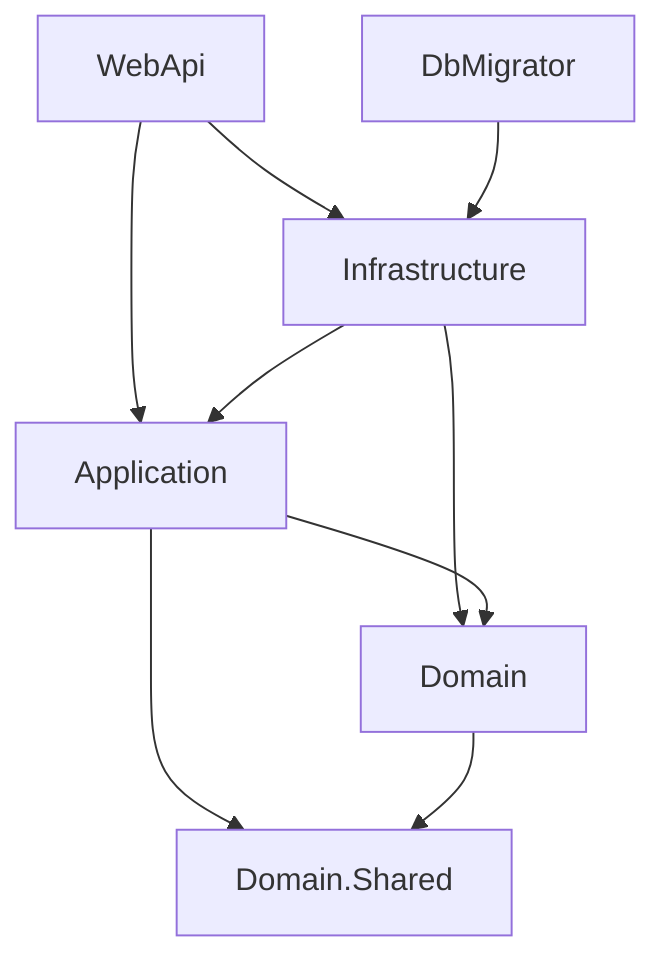

# Template Web Backend

[简体中文](../README.md) | **English**

A **.NET 10 / ASP.NET Core** backend template that creates a solution with your own project names and namespaces through `dotnet new`. It provides a starting point for business APIs with application layers, database migrations, authentication, authorization, and tests.

The examples cover users, roles, menus, and permissions, with PostgreSQL persistence, Redis sessions, JWT, captchas, DTO mapping, and a separate database migrator. Role permission snapshot provisioning and synchronization still need implementation; read [Current implementation boundaries](#current-implementation-boundaries) before integrating business features.

## Contents

- [Prerequisites](#prerequisites)
- [Create a project from the template](#create-a-project-from-the-template)
- [Local development and first startup](#local-development-and-first-startup)
- [Project structure and architecture](#project-structure-and-architecture)
- [Configuration](#configuration)
- [Database migrations](#database-migrations)
- [Deployment files and containers](#deployment-files-and-containers)
- [Testing and development conventions](#testing-and-development-conventions)
- [Current implementation boundaries](#current-implementation-boundaries)
- [Troubleshooting](#troubleshooting)

## Prerequisites

| Tool or service | Purpose |
| --- | --- |
| .NET 10 SDK | Install the template, generate projects, build, test, and run locally |
| PostgreSQL | Users, roles, permissions, and EF Core migration history |
| Redis | Active login sessions, captcha answers, and role permission snapshots |
| Git | Obtain the template source and version generated projects |
| Docker and Docker Compose (optional) | Run local dependencies or use the deployment examples |

Commands below use **PowerShell** and run from the relevant project root. On macOS/Linux, adapt environment variable syntax, paths, and HTTPS certificate trust. Builds and the existing automated tests do not require running PostgreSQL/Redis instances; full API workflows do.

## Create a project from the template

### 1. Install the local template

Obtain this repository, enter its root directory, and run:

```powershell
$templatePath = (Get-Location).Path
dotnet new install $templatePath
dotnet new list org-product-web
```

The template short name is `org-product-web`. Its definition is `.template.config/template.json` in the template source. Installation uses the source directory directly and does not require publishing a NuGet package.

### 2. Generate a named solution

From the template repository root, generate a sibling project directory:

```powershell
dotnet new org-product-web --name Acme.Demo --output ../Acme.Demo
Set-Location ../Acme.Demo
```

`--name` replaces `Org.Product` in solution names, project names, namespaces, and file contents. The result includes `Acme.Demo.sln`, `src/Acme.Demo.WebApi/`, and the other projects. `--output` selects the destination; changing that directory does not override an explicitly supplied project name.

Preview the changes before generating files:

```powershell
dotnet new org-product-web --name Acme.Demo --output ../Acme.Demo --dry-run
```

The template excludes `.git`, `.vs`, `bin`, `obj`, user settings, `*Backup*`, and `keys` content. Generated projects also omit `.template.config`; install or update the template from its source directory. Run `git init` in the generated project when you are ready to establish its own history.

Generate from a clean template checkout. The exclusion rules do not cover every deployment artifact, such as local database volume directories. Avoid distributing a template directory containing connection credentials, logs, or service data.

### 3. Update or uninstall the template

After updating the template source, reinstall it from that directory:

```powershell
dotnet new install . --force
```

To uninstall, supply the originally installed directory. Run `dotnet new uninstall` without arguments to list installed sources:

```powershell
dotnet new uninstall
dotnet new uninstall <absolute-path-to-template-source>
```

Reinstallation affects future generation; it does not update existing business projects. The generator also preserves the WebApi project's `UserSecretsId`. Before using user secrets, give each generated project's `.csproj` a unique value so separate projects do not share a secret store.

## Local development and first startup

### 1. Select the project and restore dependencies

Set the name from the generated project's root. To run the original template repository, change the first value to `Org.Product`:

```powershell
$projectName = 'Acme.Demo'
$apiProject = "src/$projectName.WebApi/$projectName.WebApi.csproj"
$migratorProject = "src/$projectName.DbMigrator/$projectName.DbMigrator.csproj"
$infrastructureProject = "src/$projectName.Infrastructure/$projectName.Infrastructure.csproj"

dotnet restore "$projectName.sln"
dotnet build "$projectName.sln" --no-restore
dotnet tool restore
```

Later commands reuse these variables; set them again in a new PowerShell session. Supply explicit `.csproj` paths to avoid ambiguity from legacy backup project files in the original template checkout.

### 2. Prepare PostgreSQL and Redis

Existing development instances are suitable. If these services are unavailable locally, the following standalone containers provide an example. Replace the database password and ensure the ports and container names are free:

```powershell
docker run -d --name acme-demo-postgres -p 127.0.0.1:5432:5432 -e POSTGRES_DB=acme_demo -e POSTGRES_USER=app -e 'POSTGRES_PASSWORD=<local-database-password>' -v acme-demo-postgres:/var/lib/postgresql/data postgres:17-alpine
docker run -d --name acme-demo-redis -p 127.0.0.1:6379:6379 redis:7-alpine
```

These ports are exposed only on the local machine. PostgreSQL uses a named volume. This Redis example has no password or persistence, so recreating it loses sessions and other stored data. If the containers already exist, use `docker start acme-demo-postgres acme-demo-redis`. Allow PostgreSQL to finish its initial setup before applying migrations.

### 3. Configure the current development session

Both WebApi and DbMigrator read these environment variables:

```powershell
$env:ConnectionStrings__Postgres = 'Host=localhost;Port=5432;Database=acme_demo;Username=app;Password=<local-database-password>'
$env:ConnectionStrings__Redis = 'localhost:6379'
$env:Jwt__Issuer = $projectName
$env:Jwt__Audience = "$projectName.Client"
$env:Jwt__KeyFolder = Join-Path (Get-Location).Path 'keys'
```

For Redis instances with authentication enabled, add the appropriate `password=...` to the connection string. Replace the repository's sample database credentials. These variables apply only to the current process and its children; set them again after closing the terminal.

### 4. Apply migrations, then start the API

```powershell
dotnet run --project $migratorProject
if ($LASTEXITCODE -ne 0) { throw 'Database migration failed. Resolve the failure before starting the API.' }

dotnet dev-certs https --trust
dotnet run --project $apiProject --launch-profile https
```

Development Swagger is available at [https://localhost:7247/swagger](https://localhost:7247/swagger), with an HTTP listener at `http://localhost:5156`. Ports come from the WebApi project's `Properties/launchSettings.json`. API startup does not create or migrate the database.

Signing keys are generated in `Jwt:KeyFolder` on first use, so that directory needs write access. Preserve the complete key pair across runs to continue validating existing signatures. Do not commit private keys.

**First-startup scope:** these steps establish the database and start the API. The initial migration includes built-in users, roles, and a root permission, but creates neither user-role assignments nor Redis permission snapshots. Endpoints with permission policies still need application-specific provisioning. A working Swagger page does not establish a complete authorization flow.

## Project structure and architecture

The template source has the following layout. Generated projects replace `Org.Product` and omit the template metadata directory.

```text
.
├── .template.config/                dotnet new template metadata
├── .config/dotnet-tools.json         Local EF Core tool
├── Org.Product.sln                  Solution
├── src/
│   ├── Org.Product.WebApi/          HTTP, authentication, authorization, composition
│   ├── Org.Product.Application/     Use cases, DTOs, mapping, capability contracts
│   ├── Org.Product.Domain/          Entities, value objects, repository/unit of work
│   ├── Org.Product.Domain.Shared/   Shared types, exceptions, enums, serialization
│   ├── Org.Product.Infrastructure/  EF Core, Redis, security, protocol adapters
│   ├── Org.Product.DbMigrator/      Standalone database migrator
│   └── Org.Product.Tests/           Automated tests and doubles
├── deployment/                     Compose and service configuration examples
├── docs/architecture.md             Detailed architecture and implementation limits
└── AGENTS.md                        Contributor guidelines
```

The main dependencies are shown below; some direct references and the test project are omitted:



Application defines the capabilities its use cases need, Infrastructure implements them, and WebApi selects and composes the implementations. Application deliberately retains `IQueryable` and EF Core asynchronous queries. Each mutation use case owns its database save. WebApi uses native `AddXxx` registrations for framework facilities such as EF Core, options, authentication, controllers, and Swagger; auto-discovered Autofac modules register application adapters from semantic interface roots. Ordinary Application services, mapping profiles, MediatR handlers, and parameterless modules do not require a `Program.cs` edit.

The stack includes EF Core/Npgsql, StackExchange.Redis, Autofac, AutoMapper, MediatR, Serilog, Swagger, and SkiaSharp. JWT validation checks both the signature and the current Redis session; a new login replaces the user's previous session.

See [Architecture](architecture.md) for the full dependency graph, request flow, domain model, transaction boundaries, DTO rules, and authorization behavior.

## Configuration

WebApi reads `appsettings.json`, environment-specific configuration, Development user secrets, and environment variables. Use double underscores for environment variable nesting, such as `ConnectionStrings__Postgres`.

| Setting | Purpose |
| --- | --- |
| `ConnectionStrings:Postgres` | PostgreSQL connection; API and migrator should target the same database |
| `ConnectionStrings:Redis` | Redis for sessions, captchas, and permission snapshots |
| `Jwt:Issuer` / `Audience` / `ExpireMin` | Token issuer, audience, and lifetime |
| `Jwt:KeyFolder` | ES256 public/private key directory |
| `Captcha:RequireVerification` / `ExpireSeconds` | Captcha validation policy and expiry |
| `Captcha:FontFamily`, dimensions, decoration flags | SkiaSharp captcha rendering |
| `OpenApiInfo` | Swagger metadata; startup requires this section to exist and be valid |
| `Serilog` | Console/file logging and levels |

The current Development configuration disables captcha verification, while the base configuration enables it. Set the intended policy explicitly for each environment. Calling the captcha generation endpoint still requires working native SkiaSharp dependencies and fonts even when login verification is disabled.

WebApi can use user secrets for local settings, but DbMigrator does not automatically read WebApi's secret store. Supply its database connection independently, preferably through session environment variables as shown above.

## Database migrations

Migration files live in `src/Org.Product.Infrastructure/Repositories/Migrations/`. DbMigrator handles database deployment; WebApi only registers and uses persistence services.

With the project variables from the local setup section:

```powershell
# Generate idempotent SQL for review without connecting to a database
dotnet run --project $migratorProject -- --script migration.sql

# Add a versioned migration after changing the model
dotnet tool restore
dotnet ef migrations add DescribeChange --project $infrastructureProject --startup-project $migratorProject --output-dir Repositories/Migrations

# Apply pending migrations to the explicitly configured database
dotnet run --project $migratorProject
```

Exit codes are `0` for success, `1` for execution failure, and `2` for invalid arguments. Subsequent runs apply only pending migrations without reinserting the initial seed data. Deploy in this order: prepare the database → complete migrations → start or upgrade the API.

The design-time factory uses a placeholder connection string only to construct the model. It does not load WebApi configuration or secrets or select the deployment target. Supply the target connection explicitly when applying migrations. A separate migration identity can have schema-change permissions while the API identity retains only application permissions; both should target the same database.

### Standalone migrator container

To execute migrations separately in a deployment pipeline, build and run from the project root:

```powershell
docker build -f "src/$projectName.DbMigrator/Dockerfile" -t acme-demo-dbmigrator:local .
$env:ConnectionStrings__Postgres = 'Host=<database-address-reachable-from-container>;Port=5432;Database=acme_demo;Username=<migration-user>;Password=<database-password>'
docker run --rm -e ConnectionStrings__Postgres acme-demo-dbmigrator:local
```

Inside a container, `localhost` refers to that container. If the database belongs to this project's Compose network, use the `migration` profile described below to connect through the `database` service name. The release process must check the migration exit code and start the API only after success.

See [Deployment files and containers](#deployment-files-and-containers) for Compose configuration and startup order, and [Architecture](architecture.md#10-database-and-container-deployment) for migration host responsibilities and dependencies.

## Deployment files and containers

### File responsibilities

| File or directory | Purpose |
| --- | --- |
| [deployment/docker-compose.yaml](../deployment/docker-compose.yaml) | Example service composition and separate migration profile |
| [WebApi/Dockerfile](../src/Org.Product.WebApi/Dockerfile) | Multi-stage API build using a .NET 10 Alpine runtime image |
| [DbMigrator/Dockerfile](../src/Org.Product.DbMigrator/Dockerfile) | Build and execute the one-shot migration process |
| `deployment/backend/webapi/appsettings.json` | Example configuration mounted into the API container |
| `deployment/cache/redis/redis.conf` | Redis configuration; currently only sets the port |
| `deployment/proxy/nginx/` | Nginx/site configuration; forwards `/api/` to `webapi:8000` |
| `deployment/proxy/mqtt.conf` | Frontend MQTT configuration example |
| `deployment/queue/mqtt/` | Mosquitto configuration and password file |
| `deployment/file/sftp/` | SFTP user configuration and runtime data location |

Compose services:

| Service | Default host ports | Description |
| --- | --- | --- |
| `database` | `5432` | PostgreSQL with a health check and data directory mount |
| `cache` | `6379` | Redis |
| `dbmigrator` | None | `migration` profile; waits for PostgreSQL health before running |
| `webapi` | `8013` → `8000` | API; currently uses a placeholder image name |
| `proxy` | `80` | Frontend static hosting and reverse proxy; placeholder image name |
| `queue` | `1883`, `9001`, and others | Mosquitto; configuration actually listens on MQTT 1883 and WebSocket 9001 |
| `file` | `122` → `22` | SFTP example |

Core API workflows use PostgreSQL and Redis. Select MQTT, SFTP, and the frontend proxy as your application requires. The repository includes neither a complete frontend nor active application integrations with MQTT/SFTP. Publishing a port does not enable MQTT TLS.

### Required deployment adjustments

1. **Images and versions:** replace `co/xxx-webapi:latest` and `co/xxx-frontend:latest` with your images. Choose fixed dependency versions and verify volume paths. The local development example uses PostgreSQL 17.
2. **API configuration:** build deployment settings from the current `src/Org.Product.WebApi/appsettings.json`. The existing deployment file contains only `ConnectionStrings`, `Jwt`, and `Serilog`; it lacks the required `OpenApiInfo` section and explicit captcha settings, so it is not a complete startup configuration.
3. **Connection addresses:** use `database:5432` and `cache:6379` inside containers. An API running on the host uses `localhost` and mapped ports. Keep database names and credentials consistent.
4. **Environment and secrets:** configure `ASPNETCORE_ENVIRONMENT`, JWT, captcha policy, logging, and credentials for the target environment. Compose currently selects Development and mounts the same file as both base and Development settings; adjust these for production.
5. **Keys and permissions:** provision the environment's complete key pair in `deployment/backend/webapi/keys/`. The example mounts it read-only at `/app/keys`, which prevents generating missing keys. Log and data directories must be writable by the container user.
6. **Redis authentication:** `redis.conf` defines neither ACLs nor `requirepass`, and the startup command does not consume `REDIS_PASSWORD`. Changing that Compose environment variable alone does not enable authentication. Configure the Redis server and matching client connection strings.
7. **Host and proxy:** adapt `/etc/timezone`, `/etc/localtime`, certificate mounts, and other paths to the host, especially Windows Docker Desktop. Configure domains, TLS termination, and forwarded headers, and verify fonts/native dependencies for captcha rendering on Alpine.

### Build and startup order

These commands assume the adjustments above are complete, `$projectName` is set, and Compose's `webapi.image` has been changed to `acme-demo-webapi:local`:

```powershell
docker build -f "src/$projectName.WebApi/Dockerfile" -t acme-demo-webapi:local .
docker compose -f deployment/docker-compose.yaml config --quiet
docker compose -f deployment/docker-compose.yaml up -d database cache

# The migrator runs inside the Compose network, so use the database service name
$env:ConnectionStrings__Postgres = 'Host=database;Port=5432;Database=acme_demo;Username=<database-user>;Password=<database-password>'
docker compose -f deployment/docker-compose.yaml --profile migration run --build --rm dbmigrator
if ($LASTEXITCODE -ne 0) { throw 'Migration did not succeed. Stop API startup.' }

docker compose -f deployment/docker-compose.yaml up -d webapi
docker compose -f deployment/docker-compose.yaml logs -f webapi
```

The example direct API address is `http://localhost:8013`; Swagger is enabled only in Development. Before returning to host-side `dotnet run`, restore the PostgreSQL hostname in `ConnectionStrings__Postgres` to `localhost`.

Compose does not make WebApi depend on successful migration completion, so your release process must enforce this order. DbMigrator receives its connection string from the environment, while WebApi reads its mounted configuration. Changing the former does not update the latter. Start the proxy, MQTT, and SFTP services separately when needed.

## Testing and development conventions

```powershell
dotnet build "$projectName.sln"
dotnet test "$projectName.sln" --no-build
dotnet test "$projectName.sln" --filter FullyQualifiedName~AuthorizationTests
```

Tests use xUnit, Moq, and ASP.NET Core TestHost. They cover layer dependencies, migration models, registration initialization, session replacement/revocation, permission checks, and key reload. Existing tests use doubles or an in-process HTTP host; they do not establish successful live migrations, Redis Lua concurrency, container startup, or font rendering.

Place routes and policies in WebApi, use cases and DTOs in Application, domain models in Domain, and database/external service implementations in Infrastructure. Maintain migrations when changing persisted models. When changing authorization, trace roles, JWT claims, Redis snapshots, and endpoint policies together.

Use `dotnet format` within the changed scope. The EF tool manifest is `.config/dotnet-tools.json`, and `dotnet tool restore` restores it. Follow Conventional Commits, such as `feat(user): add profile update`. See [Contributor guidelines](../AGENTS.md).

## Current implementation boundaries

| Capability | Current state |
| --- | --- |
| Role permission snapshots | Read from Redis; missing snapshots deny permission authorization. Automatic population, database fallback, and synchronization after role changes are not implemented |
| Initial accounts and roles | Migrations include built-in data but no user-role assignments; applications need their own provisioning and credential management |
| Database/Redis consistency | User mutations save first and revoke sessions afterward; no cross-store transaction or compensation worker |
| Generic cache queries | `ICacheQuery<TKey, TQuery, TItem>`, the convention-mapped cache base, and safe cache projections are defined, but no adapter is implemented or registered |
| Domain events | MediatR is registered, but login does not publish its event and the handler is a placeholder |
| Example services | `UpdateEnabledAsync` and `SetMenuRouteAsync` are unimplemented; `SettingService` is empty |
| Deployment verification | Compose requires customization. No application health endpoint is registered; container captcha rendering and other runtime behaviors need verification |

Detailed behavior and source locations are recorded in [Architecture](architecture.md). Keep these documents aligned when extending the template.

## Troubleshooting

- **Template `org-product-web` is missing:** install from the source root containing `.template.config/template.json`, then check `dotnet new list org-product-web`.
- **Generated projects share user secrets:** the template preserves a fixed `UserSecretsId`; assign a separate ID to each generated project.
- **API reports missing database tables:** confirm DbMigrator succeeded and both processes target the same database.
- **Container reports missing `OpenApiInfo`:** update the mounted deployment settings; host-mounted files replace the image's configuration files.
- **Redis does not require the configured `REDIS_PASSWORD`:** the example does not consume this variable; configure server ACLs or `requirepass`.
- **An unexpired JWT returns 401:** a new login, logout, user mutation, or Redis data loss may have invalidated the session. A valid signature must also match the current session.
- **Login succeeds but permission endpoints return 403:** check role claims, Redis snapshots, and exact policy strings. A database role does not imply that Redis was initialized.
- **Captcha or signing keys fail in containers:** check fonts/native dependencies for rendering, and key paths, complete key pairs, and mount permissions for signing.
