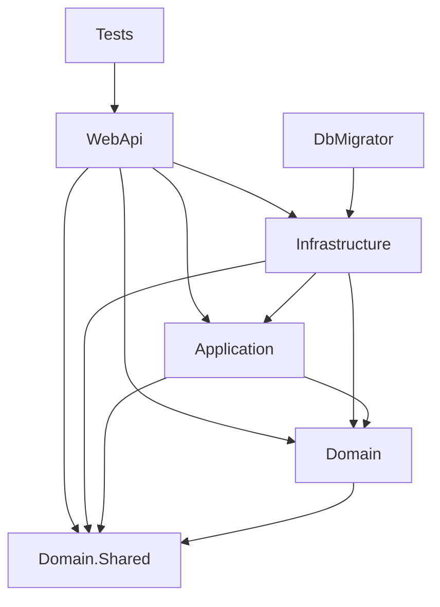
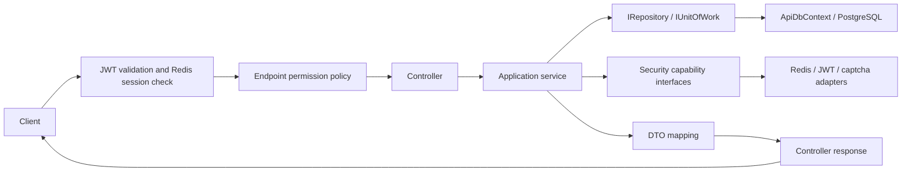

# Architecture

This document describes the implementation in `Org.Product.sln`: a .NET 10 ASP.NET Core backend template with account, role, and menu/permission examples. It separates project dependencies, runtime collaboration, and current implementation limits. Deployment examples and extension points do not imply that an integration is operational.

Use [Repository Guidelines](../AGENTS.md) for contribution commands and conventions, and the [database migration guide](README.en.md#database-migrations) for database operations.

## 1. Projects and dependency direction

All active projects live under `src/`. The table lists direct project references; package dependencies are separate.

| Project | Responsibility | Direct project references |
| --- | --- | --- |
| `Org.Product.WebApi` | HTTP controllers, authentication/authorization, responses, and composition root | Application, Infrastructure, Domain, Domain.Shared |
| `Org.Product.Application` | Use cases, DTOs, mapping, and required capability contracts | Domain, Domain.Shared |
| `Org.Product.Domain` | Entities, value objects, repository/unit-of-work contracts, and event definitions | Domain.Shared |
| `Org.Product.Domain.Shared` | Shared exceptions, attributes, enums, pagination, and serialization helpers | None |
| `Org.Product.Infrastructure` | PostgreSQL persistence, Redis stores, security implementations, and wire protocols | Application, Domain, Domain.Shared |
| `Org.Product.DbMigrator` | One-shot database migration host and EF design-time factory | Infrastructure |
| `Org.Product.Tests` | Unit, HTTP authorization, and architecture regression tests | WebApi |

Arrows mean compile-time project references. Application calls interfaces whose implementations are selected by WebApi; those runtime calls do not require an Application-to-Infrastructure reference.

The code follows layered responsibilities with inward-facing contracts, with deliberate framework coupling: Application references EF Core for LINQ execution, AutoMapper, MediatR, and options; Domain references MediatR for `INotification`. It is not a framework-free domain/application model. `Domain.Shared` is a shared library, not a dependency-injection host.

## 2. Hosts and dependency composition

[WebApi/Program.cs](../src/Org.Product.WebApi/Program.cs) owns application startup. It configures options, Serilog, controllers, JWT authentication, authorization policies, localization, Swagger, persistence, security adapters, AutoMapper, and MediatR.

Registration remains divided by responsibility:

| Registration | Responsibilities and lifetimes |
| --- | --- |
| `ApplicationModule` | Discovers Application implementations of `IBaseService`, registers their interfaces per lifetime scope, and registers the pagination converter |
| `AuthorizationModule` | Discovers pure Domain services through `IDomainService`, authorization handlers through `IAuthorizationHandler`, and JWT event types through their framework base class |
| `AddAllOptions` | Binds and validates application captcha policy, JWT validation/issuance, captcha rendering, and OpenAPI configuration through the host `IServiceCollection` |
| `AddDbContextPool<ApiDbContext>` | Native EF Core pooled request-scoped context registration in WebApi; Autofac imports it from the host service collection |
| `PersistenceModule` | Generic `IRepository<>` mapping plus scanned scoped `IUnitOfWork` and `ISqlExecutor` implementations |
| `SecurityInfrastructureModule` | Scanned `ISecurityStore` implementations per scope; scanned stateless `ISecurityService` implementations as singletons; explicit Redis connection and signing-key infrastructure |
| `DbMigrator` `Program` | Its own pooled `ApiDbContext` and `DatabaseMigrator`; it does not register HTTP, Redis, JWT, or captcha components |

Autofac is the WebApi service provider and WebApi is the composition root for the HTTP process. It automatically discovers parameterless `Module` types in the WebApi and Application assemblies. Use host `AddXxx` APIs for framework-owned integrations such as EF Core context pooling, options, authentication, controllers, and Swagger. Autofac modules scan implementation assemblies from a stable interface root whenever a semantic lifetime category exists. Registration callbacks remain for third-party client factories and framework APIs that require a concrete type. The separate DbMigrator host uses the standard host/service collection and creates only its own persistence registrations plus `DatabaseMigrator`. Its assembly dependency on Infrastructure does not start Redis, token issuance, or image rendering.

Keep host-specific configuration and transport behavior in the host. Put new external implementations in Infrastructure and their use-case-facing contracts in Application, unless the contract represents a domain responsibility such as repository access.

## 3. HTTP request and application flow

This is the protected-request collaboration flow, not a literal middleware registration diagram. Explicitly anonymous endpoints bypass authorization requirements.

- `HomeController` exposes captcha, login, registration, and authenticated logout.
- `UserController` and `RoleController` delegate account/role operations to Application services.
- `MenuController` exposes an anonymous menu tree and protected menu mutations. Menus are backed by `Permission` entities.
- `CrudAppService` provides reusable single-resource CRUD. Resource services supply their queries and behavior such as user initialization, role assignment, session revocation, and menu deletion constraints.

Controllers commonly return `ResponseWrapper<T>` with `Info`, `Data`, and `Status`. The wrapper's `Status` field is body data; HTTP status still belongs to the HTTP layer. Logout, authentication failures, model validation, and exceptions do not all use this envelope.

The exception handler writes `ExceptionReadDto`. Its current status mapping is `NotFoundException` to 404, `NotAcceptableException` to 406, and other exceptions to 500, including `ForbiddenException`. Selected custom messages use localization resources. Development responses can include stack/inner-exception details; other environments still return the top-level message. Localization resources exist, but startup does not configure request-culture middleware. See [ExceptionLocalizerExtension](../src/Org.Product.WebApi/Utilities/ExceptionLocalizerExtension.cs).

## 4. Domain and persisted model

| Model | Meaning and relationships |
| --- | --- |
| `User` | Credentials, profile, state, and roles; owns `UserSetting` and `UserDetail` through EF owned mappings |
| `Role` | Role metadata; many-to-many users through `UserRole`, and permissions through `RolePermission` |
| `Permission` | Shared catalogue/menu/button/API model, identified by `PermissionType`; `ParentId` represents its tree |
| `AggregateRoot<TKey>` | Identity and repository eligibility; currently no domain-event collection or automatic dispatch |
| `ISoftDelete`, `IAudited`, `IState`, `IOrder` | Entity capabilities; implementing an interface does not itself enforce a business rule or populate audit fields |

Domain entities currently expose mutable state, while much of the orchestration and validation lives in Application services. For example, `MenuService` rejects deleting the root or a node with children, and `UserService.ChangeRoleAsync` requires every requested role to exist before saving.

Do not conflate persisted `Permission` rows, `PermissionDefinitionAttribute` metadata on services, endpoint policy names, and Redis permission strings. They are separate representations. Startup builds authorization policies from controller `[Authorize(Policy = ...)]` attributes; it does not automatically publish service metadata into database rows or Redis snapshots.

## 5. Persistence, queries, and commit ownership

[ApiDbContext](../src/Org.Product.Infrastructure/Repositories/ApiDbContext.cs) uses PostgreSQL through Npgsql and snake_case naming. It defines relationships, unique indexes, owned values, seed data, and soft-delete query filters. Concrete persistence stays in Infrastructure:

- `IRepository<TEntity>` belongs to Domain. `Repository<TEntity>` exposes tracking queries by default, optional no-tracking queries, lookup, and change-tracker mutations. Add/update/remove do not save automatically.
- `IUnitOfWork` owns `SaveChangesAsync` and explicit transaction creation. Repository instances, `UnitOfWork`, and `SqlExecutor` share the scoped `ApiDbContext`.
- `ISqlExecutor` belongs to Application. Its `SqlCommand`/`SqlParameter` types carry SQL and parameter values without exposing `NpgsqlParameter`; Infrastructure performs the conversion. SQL executes directly, so it must not be treated as a queued repository change or assumed to apply EF entity filters.

Application intentionally composes `IQueryable` queries and uses EF methods such as `Include`, `ToListAsync`, and pagination helpers. This keeps queries convenient but retains EF/provider behavior at the Application boundary. Avoid returning deferred queries to controllers; add use-case-specific query contracts when needed.

Each public mutation use case owns its database save. Compose repository operations within that use case instead of chaining independently committing services. For multiple saves/raw SQL requiring one transaction, use `BeginTransactionAsync`, save as needed, then explicitly commit; beginning a second transaction in the same scope is rejected. Transaction commit does not replace `SaveChangesAsync`.

`ApiDbContext.SaveChangesAsync` converts deleted `ISoftDelete` entries into `SoftDeleted = true` and a UTC deletion timestamp. Model query filters hide those rows from normal queries. This is not a blanket guarantee for raw SQL or tracked lookup behavior, and it does not implement automatic audit stamping or application-level cascading soft deletion.

Database saves and Redis writes are separate operations. User changes save first and revoke sessions afterward. A database failure therefore prevents revocation, but a Redis failure after a successful save can leave committed data with an unreconciled session. There is no cross-store transaction, outbox, or retry worker closing that gap.

## 6. DTOs and mapping

Application owns request/query/read DTOs and AutoMapper profiles. WebApi discovers profiles from the Application assembly.

`DtoConventionProfile` scans concrete DTOs derived from `ReadDto<TEntity>`, `ReadDto<TEntity, TKey>`, `CreateDto<TEntity>`, and `UpdateDto<TEntity>`. Read mappings run entity-to-DTO; create/update mappings run DTO-to-entity. Types implementing `IManualDtoMapping` are excluded and require an explicit profile. The pagination converter maps `PaginatedList<T>` results.

Mapping should transform data without database access, role assignment, credential initialization, or commits. `UserRegisterDto` has a manual mapping that ignores credentials and roles; both `UserService.CreateAsync` and `RegisterAsync` use the explicit registration path to set credentials, assign the member role, and save once. Custom field names and relationships require explicit mappings rather than assumptions about convention matching.

## 7. Authentication, sessions, and permissions

### Login and token lifecycle

1. `UserService.LoginAsync` optionally verifies a captcha according to Application options.
2. It loads the user and roles, then calls `IPasswordCredentialService.Verify`.
3. `IAccessTokenIssuer` issues an ES256 token containing the user ID, comma-separated role IDs, a fresh `jti`, and configured expiry.
4. `IUserSessionStore.SaveAsync` stores the complete token under the user's Redis key with the token lifetime. A later login replaces the previous token.
5. Protected requests validate the signature, issuer, audience, and lifetime, then `SessionJwtBearerEvents` requires an exact match with the Redis session. This also applies to super-role users.

Logout supplies the authenticated token to `RevokeAsync`. The Redis adapter uses an atomic Lua compare-and-delete so an older in-flight logout cannot remove a newer session. User update/delete, role reassignment, and password change/reset revoke the current session after saving.

[PasswordCredentialService](../src/Org.Product.Infrastructure/Adapters/Security/PasswordCredentialService.cs) currently expects Base64-encoded password bytes and stores a salted SHA-256 result, with fixed-time comparison during verification. This describes the existing credential format; changing it requires an explicit compatibility/migration design. State fields alone do not constitute an account-disable policy: the current login path does not check `User.State`.

### Endpoint permission evaluation

`AuthPolicyExtensions` installs an authenticated fallback policy and discovers named policies from controller/action attributes. `[AllowAnonymous]` explicitly opens an endpoint. Plain `[Authorize]` requires authentication; a named policy also runs `CustomRequireHandler`.

The handler validates user/role GUID claims and requires Redis snapshots for every claimed role. Only then can the super-role ID bypass permission matching. Other roles grant access through an exact permission or dot-separated ancestor, using ordinal matching: `menu` grants the current `menu.delete.Id` policy, while `menu.get` does not. Policy strings must match the endpoint's spelling and casing.

### Redis semantics and consistency limits

Contracts live in `Application/Abstractions/Security`; implementations live in `Infrastructure/Adapters/Security`.

| Capability | Redis key | Current behavior |
| --- | --- | --- |
| `IUserSessionStore` | `sys:token:{userId}` | One current token per user; login TTL follows JWT lifetime; conditional or unconditional revocation |
| `ICaptchaChallengeStore` | `sys:captcha:{captchaId}` | Stores an answer with configured expiry; verification reads and compares without consuming the challenge |
| `IRolePermissionStore` | `sys:permissions:{roleId}` | JSON permission snapshots; save accepts an optional expiry; reads do not rebuild snapshots |

Missing permission keys reject authorization, including the super-role path. An existing `[]` snapshot counts as present; a partially missing set of role snapshots returns no permissions. `ContainsAsync` checks Redis keys, not database role existence or state, and its check is separate from the permission read.

No caller in the current application populates snapshots through `IRolePermissionStore.SaveAsync`; there is no database fallback on a miss or snapshot refresh/invalidation after `RoleService.ModifyRoleScopeAsync`. Consequently, migrations and role changes alone do not establish a complete authorization provisioning flow. Treat snapshot creation and synchronization as unfinished work, not an implemented cache-aside design. See [RedisRolePermissionStore](../src/Org.Product.Infrastructure/Adapters/Security/RedisRolePermissionStore.cs) and [RoleService](../src/Org.Product.Application/Services/RoleService.cs).

## 8. Other adapters and event boundaries

`ICaptchaGenerator` is implemented by `SkiaCaptchaGenerator`. Application owns verification/expiry decisions; Infrastructure owns fonts, dimensions, rendering, and image bytes. The current generator uses the question-captcha builder. The store does not implement attempt limits or one-time consumption.

`Infrastructure/Adapters/Protocols` contains binary frame, CRC, and JSON message examples. These are wire-format adapters, not domain entities or a running device-message ingestion service. The Compose MQTT service does not establish an application MQTT consumer or publisher.

MediatR scans Application handlers, and Domain declares `UserLoginEvent`. The login use case does not publish it; `UserLoginEventHandler.Handle` currently throws `NotImplementedException`. There is no implemented durable event bus, aggregate event dispatch, or outbox. Other explicit placeholders include `CrudAppService.UpdateStateAsync`, `MenuService.SetMenuRouteAsync`, and the empty `SettingService`.

## 9. Configuration and runtime assets

WebApi uses standard ASP.NET Core configuration sources, including environment-specific settings, Development user secrets, and environment variables. Options are owned by their consumers rather than collected in Domain.

| Configuration | Consumer and purpose |
| --- | --- |
| `ConnectionStrings:Postgres` | WebApi `AddDbContextPool<ApiDbContext>` and DbMigrator's local persistence registration; both must target the same database |
| `ConnectionStrings:Redis` | Shared Redis connection for sessions, captcha challenges, and permission snapshots |
| `Jwt:Issuer`, `Audience`, `KeyFolder` | WebApi authentication and signing-key loading |
| `Jwt:ExpireMin` | Security module's token issuer and resulting session TTL |
| `Captcha:RequireVerification`, `ExpireSeconds` | Application captcha policy |
| `Captcha:FontFamily`, dimensions, decoration flags | Security module's Infrastructure-backed image renderer |
| `OpenApiInfo` | WebApi Swagger document metadata |
| `Serilog` | WebApi logging configuration |

Required JWT, captcha, and OpenAPI options have startup validation; this does not prove database/Redis connectivity or rendering support. Swagger is enabled in Development. No readiness/health endpoint is registered in the current startup.

`FileSigningKeyProvider` loads `private-key.pem` and `public-key.pem` from `Jwt:KeyFolder`, generating both if either is missing. It holds them for its lifetime; there is no rotation protocol. Persist and provision a consistent pair across API instances. A fresh instance needs write access to generate them; the example Compose key mount is read-only and therefore needs pre-provisioned files. Do not commit keys or real connection credentials.

## 10. Database and container deployment

DbMigrator applies versioned migrations from `Infrastructure/Repositories/Migrations` and exits: 0 for success, 1 for failure, and 2 for invalid arguments. WebApi never initializes or upgrades the schema at startup. The design-time factory uses a placeholder PostgreSQL connection to construct the model without loading WebApi configuration.

The intended deployment order is:

1. Provision PostgreSQL, Redis, configuration, and signing keys.
2. Generate/review migration SQL or build the migrator; select the target connection explicitly.
3. Run DbMigrator and require a successful exit before starting/upgrading WebApi.
4. Complete account-role assignments and permission snapshot provisioning appropriate to the application; these are not supplied by the migration host.

The initial migration seeds built-in users, roles, and the root permission. It does not seed user-role assignments or Redis snapshots. Seeded identities/credential material are template data requiring deployment-specific handling.

`--script <path>` generates idempotent SQL without connecting to a database. Applying migrations uses `ConnectionStrings__Postgres` and only applies pending migrations. Full commands, including `dotnet ef migrations add` and standalone container execution, are maintained in the [database migration guide](README.en.md#database-migrations).

Migration files are versioned EF Core generator output. The root `.editorconfig` disables style transformations for `Infrastructure/Repositories/Migrations`, and standard `dotnet format` commands exclude that directory. This preserves generated Migration, Designer, and model-snapshot source shape and avoids history-only formatting diffs. Create model changes through `dotnet ef migrations add`; edit a migration only when the database change itself requires it.

WebApi and DbMigrator have separate Dockerfiles. [deployment/docker-compose.yaml](../deployment/docker-compose.yaml) includes PostgreSQL, Redis, MQTT, SFTP, proxy, WebApi, and a `migration` profile. Only the migrator explicitly waits for PostgreSQL health; the sample does not gate WebApi startup on migration completion. WebApi/proxy images are placeholders. MQTT/SFTP containers are deployment examples without corresponding active application integrations, and container rendering/font behavior still requires runtime verification.

## 11. Test coverage and verification boundaries

Tests use xUnit, Moq, ASP.NET Core TestHost, and local doubles under `Tests/Support`. Existing tests exercise these contracts:

| Test class | Covered behavior |
| --- | --- |
| `ArchitectureBoundaryTests` | Application assembly isolation from Infrastructure/Redis/JWT/rendering; migration presence/model alignment; offline SQL generation |
| `AuthorizationTests` | Real controllers in an in-memory test host, fallback authentication, exact/parent permissions, invalid claims, missing snapshots, logout, and invalidated tokens |
| `UserSessionTests` | Replacement login, token-specific logout, post-save revocation, invalid role assignment, and failed-save ordering |
| `UserRegistrationTests` | Shared registration/create initialization and side-effect-free credential/role mapping |
| `PermissionCacheTests` | Read-only snapshot lookup, missing/partial snapshots, and existing empty permission sets |
| `SigningKeyTests` | Token validation after key generation and reload using temporary files |

Run `dotnet test Org.Product.sln`; narrow a run with `--filter FullyQualifiedName~ArchitectureBoundaryTests` when appropriate. No coverage percentage is configured.

These tests do not establish live PostgreSQL persistence, real Redis concurrency/Lua execution, successful deployment migrations, container startup, or full WebApi startup configuration. The HTTP tests assemble their own test host, so they are not an end-to-end exercise of `WebApi/Program.cs`. Claims about those behaviors require separate runtime evidence.

## 12. Extending the template

- Add HTTP routes/policies in WebApi, use-case orchestration and DTOs in Application, domain behavior/contracts in Domain, and external implementations in Infrastructure. Application services, mapping profiles, MediatR handlers, and parameterless Autofac modules in the WebApi/Application assemblies are discovered automatically. Use framework `AddXxx` registrations in the executable host before writing equivalent container code. For application-specific adapters, extend an existing semantic registration root (`IBaseService`, `IDomainService`, `ISecurityStore`, or `ISecurityService`) when its lifecycle matches; add a new root only when it represents a real capability category. Generic contracts and third-party client factories remain explicit inside the responsible module. Each executable host remains the composition root for the implementations it consumes.
- Keep transaction ownership explicit. New cross-store side effects need a defined failure/recovery strategy; an interface alone does not provide atomicity.
- For model changes, add a migration and update the model snapshot. For authorization changes, trace database roles, JWT claims, Redis snapshots, and controller policy names together.
- Preserve DTO convention/manual-map boundaries and add behavior-focused tests at the layer being changed. Do not expose placeholder methods as completed capabilities.
- `.template.config/template.json` defines `org-product-web` and replaces the `Org.Product` naming token. Build solution-listed projects; legacy `*Backup*` files are excluded from template generation. Update this document when dependency direction, configuration ownership, or runtime behavior changes.
